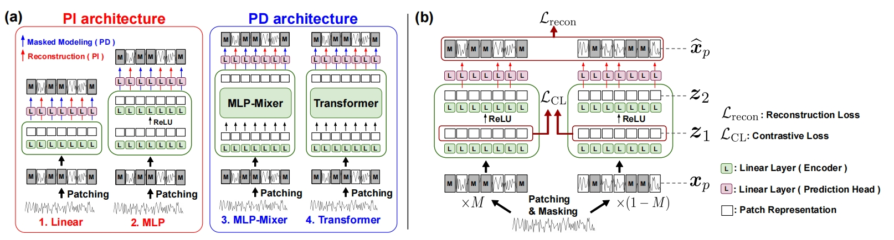
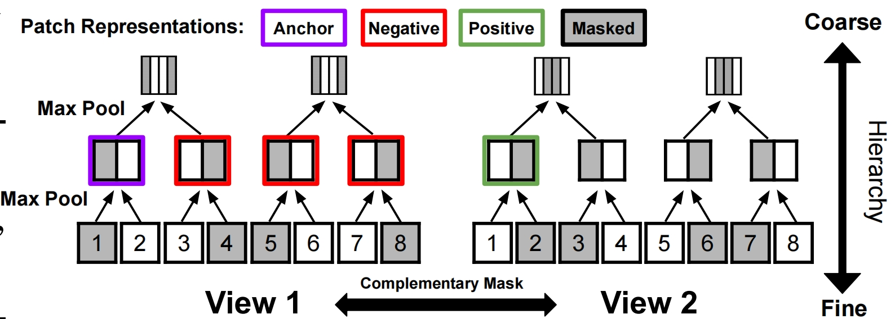
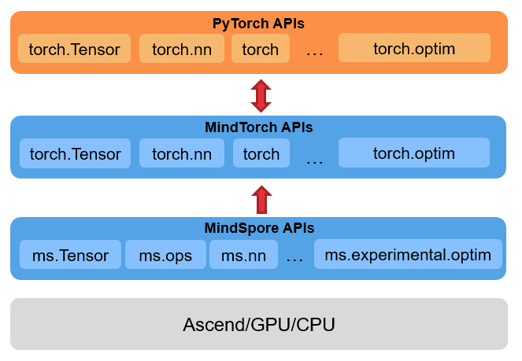
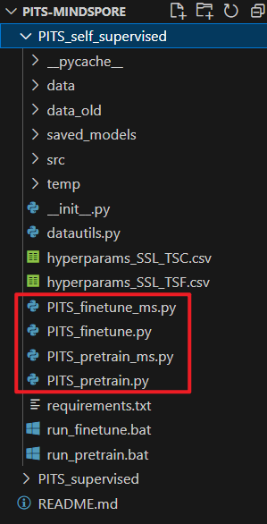
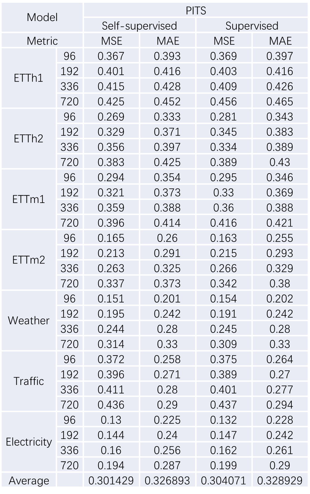
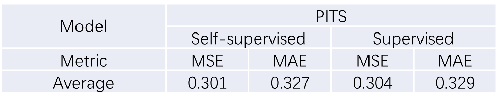

# Self-supervised Representation Learning with Patch-independent Strategies for Time Series (PITS)

## 1. 概述

本文提出了一种基于Patch独立策略的时间序列自监督表示学习方法，称为PITS（Patch-Independent Time Series）。PITS通过引入Patch独立的重建任务和互补对比学习，有效地捕捉时间序列信息，提升了模型在时间序列预测和分类任务中的表现。

## 2. 模型介绍

PITS模型主要包含以下两个创新点：

1. **Patch独立重建任务**：不同于传统的依赖于其他patch进行预测的Masked Modeling（MM）任务，PITS通过自动编码每个patch，避免了捕捉patch依赖性，从而提高了模型效率和性能。

   

2. **互补对比学习**：通过互补随机遮掩策略生成正样本对，层次化地捕捉相邻时间序列信息，从而进一步提升表示学习的性能。

​	

## 3. 数据集介绍

本文利用多个公开的时间序列数据集进行验证，包括ETT、Weather、Traffic和Electricity数据集等。

### 3.1 ETT数据集

ETT（Electricity Transformer Temperature）数据集用于电力变压器温度的预测。该数据集包含ETTh1、ETTh2、ETTm1和ETTm2四个子集，每个子集包括以下信息：

- **ETTh1**: 每小时的数据，共包含12个特征和12,000个时间步。
- **ETTh2**: 每小时的数据，共包含12个特征和12,000个时间步。
- **ETTm1**: 每15分钟的数据，共包含12个特征和28,000个时间步。
- **ETTm2**: 每15分钟的数据，共包含12个特征和28,000个时间步。

这些子集主要用于验证模型在长时间序列预测中的性能。

### 3.2 Weather数据集

Weather数据集包含2010年至2013年间的美国大气数据，用于天气预测。该数据集包含：

- **数据量**: 52696个时间步。
- **特征**: 21个，包括气温、气压、湿度、风速等。

这些特征用于预测未来的天气情况，如温度、湿度等，验证模型在不同气候条件下的预测能力。

### 3.3 Traffic数据集

Traffic数据集包含2015年至2016年间的交通流量数据，用于交通流量预测。该数据集包含：

- **数据量**: 17544个时间步。
- **特征**: 862个，代表不同地点的交通流量。

该数据集用于评估模型在高维度、复杂时间序列数据上的表现。

### 3.4 Electricity数据集

Electricity数据集包含2012年至2014年间的电力消耗数据，用于电力消耗预测。该数据集包含：

- **数据量**: 26304个时间步。
- **特征**: 321个，代表不同家庭的电力消耗。

该数据集用于评估模型在电力需求预测中的应用效果。

### 3.5 Epilepsy数据集

Epilepsy数据集包含癫痫患者和健康人的脑电图数据，用于癫痫发作检测。该数据集包含：

- **数据量**: 11,500个时间步。
- **特征**: 1个，代表单导联的脑电图数据。

该数据集用于评估模型在健康监测和疾病检测方面的应用效果。


## 4. 实验设置

### 4.1 自监督学习

在自监督预训练阶段，我们使用简单的MLP架构，通过线性探测（Linear probing）和端到端微调（End-to-end fine-tuning）来更新模型。

### 4.2 监督学习

在监督学习阶段，使用全连接层和两层MLP对数据进行预测。


## 5. PyTorch脚本到Mindspore脚本的转换

为高效率迁移模型及代码，此处使用鹏城实验室和华为联合开发的一款Mindspore生态适配工具——**MSadapter**。该工具能帮助用户高效使用昇腾算力，且在不改变**原有PyTorch用户**使用习惯的前提下，将代码快速迁移到Mindspore生态上。



### 5.1 MSadapter安装

通过pip安装：

```bash
pip install msadapter
```

通过源码安装：

```bash
git clone https://git.openi.org.cn/OpenI/MSAdapter.git 
cd MSAdapter 
python setup.py install
```

### 5.2 MSadapter迁移指南

**Step1：替换导入模块（修改头文件）**

```python
# import torch
# import torch.nn as nn
# import torchvision import datasets, transforms

import msadapter.pytorch as torch
import msadapter.pytorch.nn as nn
import msadapter.torchvision import datasets, transforms
import mindspore as ms
```

**Step2：替换数据处理部分（修改头文件）**

```python
from msadapter.pytorch.utils.data import DataLoader
```

**Step3：换网络训练脚本（修改代码写法）**

```python
# optimizer = torch.optim.SGD(net.parameters(), lr=0.01, momentum=0.9, weight_decay=0.0005)

optimizer = ms.nn.SGD(net.trainable_params(), learning_rate=0.01, momentum=0.9, weight_decay=0.0005)
```

更多迁移细节可参考：https://openi.pcl.ac.cn/OpenI/MSAdapter

### 5.3 详细迁移代码

#### 数据集实现

```python
import numpy as np
import pandas as pd
# import torch
# from torch import nn
import msadapter.pytorch as torch
import msadapter.pytorch.nn as nn
import sys
import msadapter as ms

from src.data.datamodule import DataLoaders
from src.data.pred_dataset import *

DSETS = ['ettm1', 'ettm2', 'etth1', 'etth2', 'electricity',
         'traffic', 'illness', 'weather', 'exchange'
        ]


//......


if __name__ == "__main__":
    class Params:
        dset= 'etth2'
        context_points= 384
        target_points= 96
        batch_size= 64
        num_workers= 8
        with_ray= False
        features='M'
    params = Params 
    dls = get_dls(params)
    for i, batch in enumerate(dls.valid):
        print(i, len(batch), batch[0].shape, batch[1].shape)
    breakpoint()
```


#### 网络实现

```python
import numpy as np
import pandas as pd
import os
# import torch
import msadapter.pytorch as torch
import random
import sys
import msadapter as ms

from src.models.PITS import PITS
from src.learner import Learner
from src.callback.tracking import *
from src.callback.patch_mask import *
from src.callback.transforms import *
from src.metrics import *
from src.basics import set_device
from datautils import *

import argparse

parser = argparse.ArgumentParser()
# Dataset and dataloader
parser.add_argument('--cls', type=int, default=0, help='classification or not')
parser.add_argument('--pretrain_task', type=str, default='PI', help='PI vs. PD')
parser.add_argument('--CI', type=int, default=1, help='channel independence or not')

parser.add_argument('--instance_CL', type=int, default=0, help='Instance-wise contrastive learning')
parser.add_argument('--temporal_CL', type=int, default=1, help='Temporal contrastive learning')

parser.add_argument('--head_dropout', type=float, default=0.2, help='head dropout')
parser.add_argument('--dset_pretrain', type=str, default='etth1', help='dataset name')
parser.add_argument('--context_points', type=int, default=512, help='sequence length')
parser.add_argument('--target_points', type=int, default=96, help='forecast horizon')
parser.add_argument('--batch_size', type=int, default=64, help='batch size')
parser.add_argument('--num_workers', type=int, default=0, help='number of workers for DataLoader')
parser.add_argument('--scaler', type=str, default='standard', help='scale the input data')
parser.add_argument('--features', type=str, default='M', help='for multivariate model or univariate model')

# Patch
parser.add_argument('--patch_len', type=int, default=12, help='patch length')
parser.add_argument('--stride', type=int, default=12, help='stride between patch')

# RevIN
parser.add_argument('--revin', type=int, default=1, help='reversible instance normalization')
parser.add_argument('--mean_norm', type=int, default=0, help='reversible instance normalization')

# Model args
parser.add_argument('--d_model', type=int, default=128, help='hidden dimension of MLP')
parser.add_argument('--mask_ratio', type=float, default=0.5, help='masking ratio for the input')
parser.add_argument('--mask_schedule', type=float, default=0, help='mask_schedule')

# Optimization args
parser.add_argument('--n_epochs_pretrain', type=int, default=100, help='number of pre-training epochs')
parser.add_argument('--lr', type=float, default=1e-4, help='learning rate')
parser.add_argument('--pretrained_model_id', type=int, default=1, help='id of the saved pretrained model')
parser.add_argument('--model_type', type=str, default='based_model', help='for multivariate model or univariate model')

# Device Id
parser.add_argument('--device_id', type=int, default=0, help='Device ID')
parser.add_argument('--seed', type=int, default=1, help='Random Seed')

args = parser.parse_args()

//......
```

注：带`ms`后缀的为修改后的版本，例如




## 6. 实验步骤

### 6.1TS预测

根据**PatchTST下载数据集**

将数据文件放在

- `\PITS_self_supervised\data\`

- `\PITS_supervised\data\`

  

#### 1）数据集和超参数

```python
ds_pretrain = 'etth1'
ds_finetune = 'etth1'

# (1) Model Size
d_model = 128

# (2) Input Size
context_points = 512
patch_len = stride = 12
num_patches = context_points//patch_len

# (3) Finetune Epoch
ep_ft_head = 5
ep_ft_entire = ep_ft_head * 2
```

#### 2）预训练

```bash
!python PITS_pretrain.py --dset_pretrain {ds_pretrain} \
    --context_points {context_points} --d_model {d_model} --patch_len {patch_len} --stride {stride} \
```

#### 3）微调

```bash
for pred_len in [96, 192, 336, 720]:
  !python PITS_finetune.py --dset_pretrain {ds_pretrain} --dset_finetune {ds_finetune} \
    --n_epochs_finetune_head {ep_ft_head} --n_epochs_finetune_entire {ep_ft_entire} \
    --target_points {pred_len} --num_patches {num_patches} --context_points {context_points} \
    --d_model {d_model} --patch_len {patch_len} --stride {stride} \
      --is_finetune 1 
```

### 6.2 TS分类

下载数据集

将数据文件放在

- `\PITS_self_supervised\data\`

#### 1）数据集和超参数

```python
# ep_pretrain = xx
# ep_ft_head = xx
# ep_ft_entire = ep_ft_head * 2
# d_model = xx
# patch_len = stride = xx
# aggregate = xx

context_points = 176
num_patches = int(cp/stride)
batch_size = 128

# ft_data_length = xx
# num_classes = xx
```

```python
ds_pretrain = 'SleepEEG'
ds_finteune = 'Epilepsy' # ['Epilepsy','FD_B','Gesture','EMG']
```

#### 2）预训练

```bash
!python PITS_pretrain.py --dset_pretrain {ds_pretrain} \
    --n_epochs_pretrain {ep_pretrain}  --context_points {context_points} \
	--d_model {d_model} --patch_len {patch_len} --stride {stride} 
```

#### 3）微调

```bash
!python PITS_finetune.py --dset_pretrain {ds_pretrain} --dset_finetune {ds_finetune} \
    --n_epochs_finetune_head {ep_ft_head} --n_epochs_finetune_entire {ep_ft_entire} \
    --target_points {num_classes} --num_patches {num_patches} --context_points {context_points} \
    --d_model {d_model} --patch_len {patch_len} --stride {stride} --aggregate {aggregate} \
    --is_finetune_cls 1 --cls 1 
```


## 7. 实验结果

通过大量实验，PITS在时间序列预测和分类任务中均表现出优于现有方法的性能。以下是部分实验结果的展示：

### 7.1 时间序列预测



### 7.2 时间序列分类


